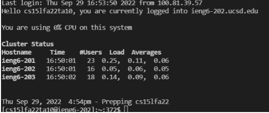
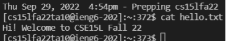
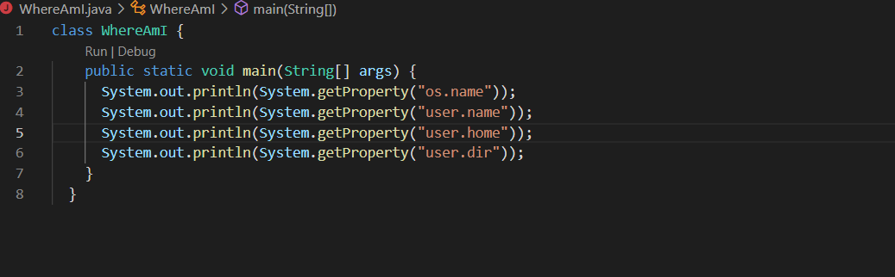
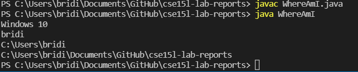
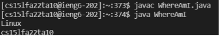
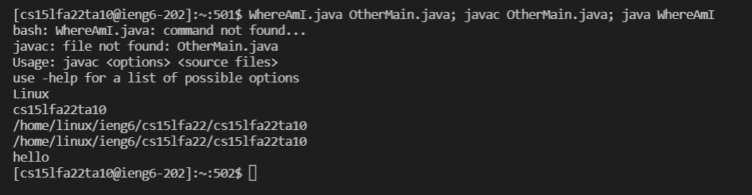

# Lab1
Remote Access and the Filesystem
1. Install VScode  
  
* First make sure that the user's computer does not have VSCode installed already
* If not then go to the following website to install [Vscode](https://code.visualstudio.com/)
* I already had VSCode installed on my computer  
2. Remotely Connecting  
  
* first is to install OpenSSH [Here is the link to download OpenSSH](https://learn.microsoft.com/en-us/windows-server/administration/openssh/openssh_install_firstuse?tabs=gui#install-openssh-for-windows)
* * verify that SSH host is connected by running *ssh user@domain@hostname
* Then to connect to the remote computer but using VSCode by opening terminal in VSCode
* To open terminal use ctrl '+'
* In the terminal the command should be ssh cs15lfa22oj@ieng6.ucsd.edu (type yes)
** To find the username go to this [link] (https://sdacs.ucsd.edu/~icc/index.php) then look up your account by entering the Username and Student ID
** After finding the username follow this [link] (https://password.ucsd.edu/) to change the password for this specific account
* Replace the last two letter in the username cs15lfa22oj to the user's specific username

3. Run Some Commands  
  
* After ssh-ing run commands
* one example is in the image above which I used the command cat /home/linux/ieng6/cs15lfa22/public/hello.txt
** the command above ^ allows the user to view the file hello.txt
** other command is ls </home/linux/ieng6/cs15lfa22/cs15lfa22oj this would list all the files and directories
4. Moving Files over SSH with scp
* To copy file from personal computer to remote computer use the command scp; scp WhereAmI.java cs15lfa22oj@ieng6.ucsd.edu
** make sure it is run form the client not logged into ieng6
* Create a file WhereAmI.java  
 
* Run command javac WhereAmi.java / java WhereAmI in client  
  
* Client shows that it runs on window 10 (my laptop) 
* Log into ieng6 and repeat the command above  
 
* Shows that it runs on linux on server
5. SSH Keys
* use ssh-keygen to create a pair of files called public key and private key
* Then copy the public key to .ssh directory of user account on ther server
 
6. Making Remote Running Even More Pleasant 
 
* Use semicolons to run multiple commands on the same line
* up arrow on keyboard to recall last command that was run

