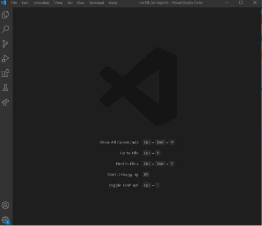
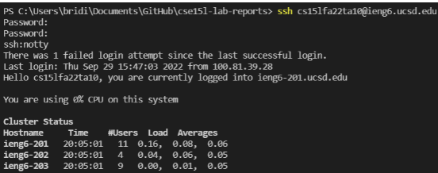

# Lab1
Remote Access and the Filesystem
1. Install VScode  
  
* First make sure that the user's computer does not have VSCode installed already
* If not then go to the following website to install [Vscode]((https://code.visualstudio.com/)
* I already had VSCode installed on my computer  
2. Remotely Connecting  
![remotelyconnecting] (sc2.png)  
* first is to install OpenSSH
* * verify that SSh host is connected by running *ssh user@domain@hostname
* Then to connect to the remote computer but using VSCode by opening terminal in VSCode
* In the terminal the command should be ssh cs15lfa22oj@ieng6.ucsd.edu (type yes)
3. Run Some Commands  
![commands] (sc3.png)  
* After ssh-ing run commands
* one example is in the image above which I used the command cat /home/linux/ieng6/cs15lfa22/public/hello.txt
4. Moving Files over SSH with scp
* To copy file from personal computer to remote computer use the command scp
** make sure it is run form the client not logged into ieng6
* Creat a file WhereAmI.java  
 
* Run command javac WhereAmi.java / java WhereAmI in client  
  
* Client shows that it runs on window 10 (my laptop) 
* Log into ieng6 and repeat the command above  

* Shows that it runs on linux on server
5. SSH Keys
* use ssh-keygen to create a pair of files called public key and private key
* Then copy the public key to .ssh directory of user account on ther server
 
6. Making Remote Running Even More Pleasant
* 
